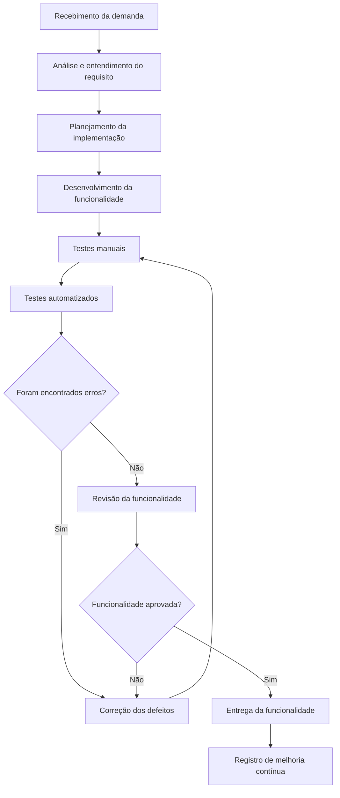

# Centro Universitário Senac-RS

**Curso:** ADS - Análise e Desenvolvimento de Sistemas / SPI - Sistemas para Internet  
**Unidade Curricular:** Qualidade de Software  
**Professor:** Luciano Zanuz  

---

# 🧩 Atividade PBL – Aula 14

## Qualidade de Processo – LocalEats

---

## Integrantes

- Gabriel Menezes Rehbein
- Nome do integrante 2
- Nome do integrante 3
- Nome do integrante 4

---

# 1. Mapeamento do Processo Atual

O processo atual de desenvolvimento e validação do sistema **LocalEats** segue um fluxo baseado no recebimento de demandas, análise dos requisitos, desenvolvimento da funcionalidade, validação por meio de testes, correção de falhas e entrega da versão final.

O objetivo do mapeamento é compreender como a equipe produz software e em quais momentos a qualidade é verificada durante o processo.

---

## Fluxograma do Processo

## Descrição do Processo

O processo inicia quando a equipe recebe uma nova demanda relacionada ao sistema LocalEats. Essa demanda pode representar uma nova funcionalidade, uma melhoria em algo já existente ou a correção de um problema identificado anteriormente.

Após o recebimento, a equipe analisa o requisito para compreender o que deve ser desenvolvido, quais regras precisam ser respeitadas e qual impacto essa alteração pode causar no sistema.

Em seguida, ocorre o planejamento da implementação. Nessa etapa, a equipe define como a funcionalidade será desenvolvida, quais arquivos ou módulos serão alterados e quais testes deverão ser realizados.

Depois do planejamento, a equipe realiza o desenvolvimento da funcionalidade. O código é implementado de acordo com o requisito definido e com atenção à organização, legibilidade e manutenção futura.

Após o desenvolvimento, são realizados testes manuais para verificar se a funcionalidade está funcionando corretamente do ponto de vista do usuário. Em seguida, podem ser realizados testes automatizados, TDD ou validações baseadas em BDD, quando aplicável.

Caso sejam encontrados erros, a funcionalidade retorna para a etapa de correção. Após a correção, os testes são executados novamente até que a funcionalidade esteja estável.

Quando a funcionalidade é aprovada, ela é entregue e registrada como parte do processo de melhoria contínua da equipe.

## 2. Identificação de Entradas, Atividades e Saídas

| Etapa | Entrada | Atividade | Saída |
| --- | --- | --- | --- |
| Recebimento da demanda | Necessidade do usuário, professor ou equipe | Registrar e compreender a solicitação | Demanda documentada |
| Análise do requisito | Demanda documentada | Interpretar o requisito e identificar regras de negócio | Requisito compreendido |
| Planejamento da implementação | Requisito compreendido | Definir como a funcionalidade será desenvolvida e validada | Plano de desenvolvimento |
| Desenvolvimento | Plano de desenvolvimento | Implementar a funcionalidade no sistema | Código desenvolvido |
| Testes manuais | Código desenvolvido | Validar o funcionamento da funcionalidade pela interface | Resultado dos testes manuais |
| Testes automatizados | Código desenvolvido | Executar scripts de teste para verificar comportamentos esperados | Relatório ou evidência dos testes |
| Correção de defeitos | Erros encontrados nos testes | Ajustar o código para corrigir falhas | Código corrigido |
| Revisão da funcionalidade | Código corrigido e testado | Verificar se a solução atende ao requisito inicial | Funcionalidade aprovada ou reprovada |
| Entrega | Funcionalidade aprovada | Disponibilizar a funcionalidade para uso | Funcionalidade entregue |
| Melhoria contínua | Experiência do processo | Identificar problemas no fluxo e propor melhorias | Processo aprimorado |

## 3. Reflexão sobre o Processo

### O processo utilizado pela equipe está claramente definido?

O processo está parcialmente definido, pois a equipe já segue etapas importantes como desenvolvimento, testes, correções e entrega. Porém, algumas etapas podem ser melhor formalizadas, principalmente o registro das demandas, a documentação dos requisitos e a definição clara dos critérios de aceite.

Quando o processo não está totalmente documentado, cada integrante pode interpretar as tarefas de uma forma diferente, o que pode gerar retrabalho, falhas de comunicação e atrasos na entrega.

Para melhorar, a equipe pode criar um fluxo padrão para todas as funcionalidades, definindo quais etapas devem ser seguidas antes de considerar uma tarefa finalizada.

### Todos os integrantes seguem o mesmo fluxo de trabalho?

Nem sempre todos os integrantes seguem exatamente o mesmo fluxo. Em alguns momentos, cada pessoa pode desenvolver ou testar de uma maneira própria, principalmente quando não existe um processo padronizado.

Isso pode prejudicar a qualidade do projeto, pois uma funcionalidade pode ser bem testada enquanto outra pode ser entregue com pouca validação.

O ideal é que todos os integrantes sigam um fluxo comum, com etapas mínimas obrigatórias, como:

- Entender o requisito;
- Desenvolver a funcionalidade;
- Realizar testes manuais;
- Corrigir falhas encontradas;
- Revisar antes da entrega;
- Registrar o que foi feito.

Dessa forma, a equipe mantém um padrão de qualidade mais consistente.

### Em quais etapas a qualidade é verificada?

A qualidade é verificada principalmente nas etapas de:

- Análise do requisito;
- Desenvolvimento;
- Testes manuais;
- Testes automatizados;
- Correção de defeitos;
- Revisão da funcionalidade;
- Entrega.

Na análise do requisito, a qualidade aparece quando a equipe verifica se entendeu corretamente o que deve ser desenvolvido.

No desenvolvimento, a qualidade está relacionada à organização do código, clareza, reutilização, tratamento de erros e manutenção.

Nos testes manuais e automatizados, a qualidade é verificada por meio da validação do comportamento esperado do sistema.

Na correção de defeitos, a qualidade é aplicada para garantir que os erros sejam resolvidos sem gerar novos problemas.

Na revisão final, a equipe confirma se a funcionalidade realmente atende à demanda inicial.

### Quais melhorias poderiam tornar o processo mais eficiente?

Algumas melhorias que poderiam tornar o processo mais eficiente são:

- Criar um checklist de qualidade antes da entrega;
- Registrar todas as demandas de forma clara;
- Definir critérios de aceite para cada funcionalidade;
- Padronizar a forma como os testes são executados;
- Utilizar versionamento com commits organizados;
- Revisar o código antes de finalizar uma tarefa;
- Automatizar testes repetitivos;
- Documentar erros encontrados e soluções aplicadas;
- Melhorar a comunicação entre os integrantes;
- Utilizar um quadro Kanban ou Scrum para acompanhar o andamento das tarefas.

Essas melhorias ajudam a reduzir retrabalho, melhorar a comunicação e aumentar a previsibilidade do processo.

### Como a qualidade do processo impacta a qualidade do produto final?

A qualidade do processo impacta diretamente a qualidade do produto final, pois um software não depende apenas do código escrito, mas também da forma como ele é planejado, desenvolvido, testado e entregue.

Quando o processo é bem definido, a equipe consegue identificar erros mais cedo, reduzir falhas recorrentes, organizar melhor as tarefas e entregar funcionalidades mais estáveis.

Por outro lado, quando o processo é desorganizado, aumentam as chances de problemas como:

- Funcionalidades incompletas;
- Falhas não identificadas;
- Retrabalho;
- Atrasos;
- Dificuldade de manutenção;
- Código despadronizado;
- Baixa confiabilidade do sistema.

No caso do LocalEats, um processo de qualidade bem estruturado contribui para que o sistema seja mais confiável, organizado, fácil de manter e alinhado às necessidades dos usuários.

## 4. Análise Crítica do Processo

A equipe já utiliza práticas importantes de qualidade, como testes manuais, testes automatizados, TDD e BDD. Essas práticas ajudam a validar o comportamento do sistema e diminuem a chance de defeitos chegarem até o usuário final.

No entanto, para alcançar um processo mais maduro, é importante que essas práticas estejam integradas a um fluxo de trabalho bem definido. Não basta testar o produto no final; a qualidade precisa estar presente desde o início do processo.

A principal melhoria seria transformar o processo em um padrão seguido por todos os integrantes. Isso permitiria que cada nova funcionalidade passasse pelas mesmas etapas de análise, desenvolvimento, teste, correção e revisão.

Além disso, a equipe poderia registrar melhor as decisões tomadas durante o desenvolvimento. Isso facilitaria a manutenção futura e ajudaria novos integrantes a entenderem o funcionamento do sistema.

Com um processo mais organizado, o LocalEats tende a evoluir com mais segurança, menos erros e maior qualidade.

## 5. Checklist de Qualidade do Processo

Antes de entregar uma funcionalidade, a equipe pode utilizar o seguinte checklist:

| Item | Verificação | Status |
| --- | --- | --- |
| 1 | A demanda foi compreendida pela equipe? | Pendente |
| 2 | O requisito foi analisado antes do desenvolvimento? | Pendente |
| 3 | A funcionalidade foi implementada corretamente? | Pendente |
| 4 | O código foi revisado? | Pendente |
| 5 | Foram realizados testes manuais? | Pendente |
| 6 | Foram realizados testes automatizados, quando aplicável? | Pendente |
| 7 | Os erros encontrados foram corrigidos? | Pendente |
| 8 | A funcionalidade atende ao requisito inicial? | Pendente |
| 9 | A entrega foi registrada no repositório? | Pendente |
| 10 | Foram identificadas melhorias para o processo? | Pendente |

## 6. Conclusão

A qualidade de processo é essencial para garantir que o desenvolvimento do software aconteça de forma organizada, previsível e eficiente.

No sistema LocalEats, a equipe já trabalhou com práticas importantes de qualidade, como planejamento de testes, testes manuais, testes automatizados, TDD e BDD. Porém, além de testar o produto, é necessário avaliar também o processo utilizado para construí-lo.

O mapeamento do processo permite visualizar melhor como a equipe trabalha, quais são as entradas, atividades e saídas de cada etapa e onde a qualidade pode ser verificada.

Com um processo mais claro, padronizado e documentado, a equipe consegue reduzir retrabalho, melhorar a comunicação, encontrar defeitos mais cedo e entregar um produto final com maior qualidade.

Portanto, a qualidade do processo influencia diretamente a qualidade do software produzido.